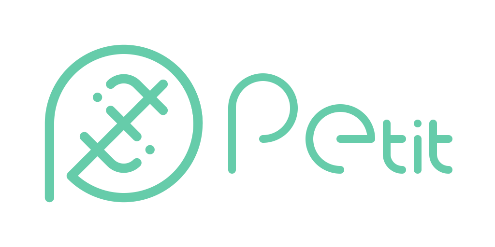

# PetitJS

PetitJS - set of *petit* and useful JS libs

## libs

⛓: method chaining design

### WebGL

- **PetitGL** WebGL wrapper ⛓ WIP
- **PetitMQ** matrix & quaternion calc ⛓ [doc](docs/mq.md) [src](mq.mjs) *4.26kB*
- **PetitPrim** primitive models & obj loader [doc](docs/prim.md) [src](prim.mjs) *2.34kB*

### Utility

- **PetitCol** color convertion [doc](docs/col.md) [src](col.mjs) *395B*
- **PetitZip** zip unzip & DL helper [doc](docs/zip.md) [src](zip.mjs) *3.0kB*
- **PetitRiff** RIFF parser WIP ~~doc~~ [src](riff.mjs) *297B*
- **PetitSJIS** Shift-JIS encoder & decoder [doc](docs/sjis.md) [src](sjis.mjs) *596B*
- **PetitPNG** PNG binary generator [doc](docs/png.md) [src](png.mjs) *1.48kB*
- **PetitNBT** NBT reader & writer [doc](docs/nbt.md) [src](nbt.mjs) *2.3kB*
- **PetitQR** QRCode encoder ⛓ [doc](docs/qr.md) [src](qr.mjs) *8.7kB*
- **PetitTrace** Bitmap tracer [src](trace.mjs) *1.5kB*
- **PetitTOTP** TOTP generator & migration url decoder  [src](totp.mjs) *1.7kB*
- **PetitProtoBuf** protocolbuffer decoder [src](protobuf.mjs) *408B*

### SVG

- **PetitSVG** SVG path manipulation ⛓ WIP

### WebAudio

- **PetitAudio** WebAudio functions [doc](docs/audio.md) [src](audio.mjs) *1.36kB*
- **PetitSMF** SMF(MIDI)file parser WIP ~~doc~~ [src](riff.mjs) *1.33kB*

## Planning

- ID3
- OTF SFNT Hershey

## Requirement

iOS12~ equivalent web techs

## License

MIT License
